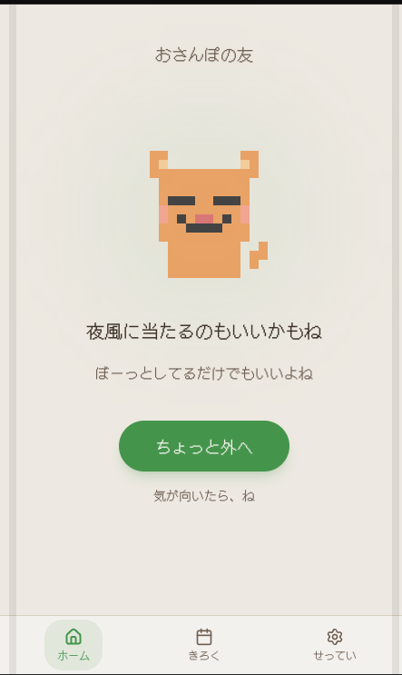
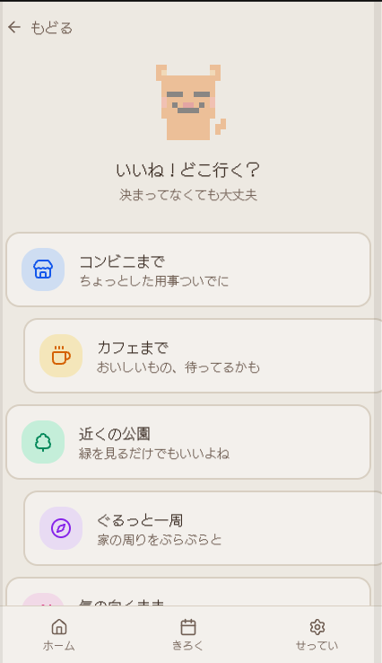
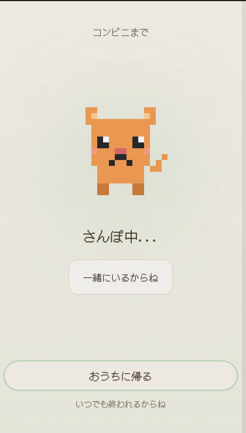
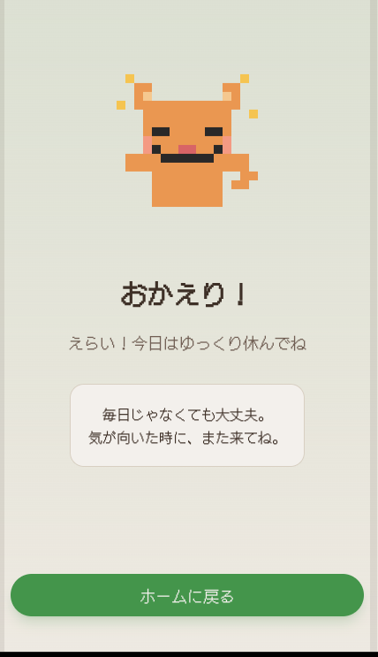
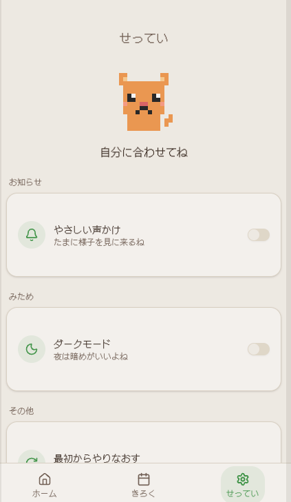

# character-support-walk
- バックエンド技術を深く理解するために、実際のサービス開発を想定して設計・実装を行った個人開発プロジェクトです。

## サービス概要
- Character Support Walk は、「少しだけ外へ出るハードルを下げる」ことを目的とした散歩サポートアプリです。
- なんとなく外に出たいけれど動き出せない人に対して、8bitキャラクターが小さなきっかけをくれる体験を提供します。
- 歩数競争やSNS共有を前提とせず、「少し外へ出られた」という小さな行動を肯定することを重視しています。

## ユーザー
- 外に出るのが億劫な人
- 気分転換したい人
- 散歩したいが行き先に困る人
- 継続が苦手な人
- 頑張りすぎるアプリに疲れてしまった人

## ユーザーが抱える課題
現代では、運動や健康管理アプリの多くが「継続」や「成果」を強く求める傾向があります。
- 毎日歩かなければいけない
- 歩数を増やさなければいけない
- 他人と比較してしまう
- SNS投稿が前提になっている

こうした体験が負担となり、次第に「外へ出ること自体」が億劫になってしまうことがあります。
また、外に出たい気持ちはあっても、
- 行き先が決まらない
- 準備が面倒
- 最初の一歩が重い

といった理由で行動できないケースもあります。

## 解決方法
### Character Support Walk では、「小さく外へ出る」ことを支援します。
ユーザーは、
- 数分だけ歩く
- 少し外へ出る
- 行き先を選ぶ

といった軽い行動から始められます。

アプリ内では8bitの犬・猫キャラクターが応援し、
- 散歩完了時に反応する
- 継続によって表情が変わる
- 小さな成長を見せる

ことで、ユーザーが無理なく外へ出るきっかけを作ります。

## プロダクト
### 「少しだけ外へ出られた」を肯定する散歩サポートアプリケーションです。
歩数競争やSNS共有ではなく、
- 外へ出るきっかけ
- 気分転換
- 小さな達成感
を重視しています。

## マーケット
- 外出へのハードルを感じている人
- 軽い運動習慣を作りたい人
- メンタルケアや気分転換を求める人
- 強いゲーミフィケーションに疲れた人

を主なターゲットとしています。

また、「頑張る健康管理」ではなく、
> 少し外へ出るだけでも十分

という価値観を提供するアプリを目指しています。

## アプリのイメージ
### アプリのホーム画面


### おさんぽ開始ボタン後


### おさんぽ中画面


### おさんぽ完了後


### 設定画面


## 技術選定
### Golang(Echo)
- Golangはこれまで実務で使用していた経験があり、さらに理解を深めることを目的として使用しました。
### レイヤードアーキテクチャ
- プレゼンテーション層(handler), ユースケース層、インフラ層を分離し、各層がそれぞれの責務を持つように設計しました。これにより疎結合な構成となり、実装の差し替えや機能追加を容易にしています。またRepositoryをインターフェース化することでモックを利用したユニットテストを実現し、テスト容易性を高めています。
### Google OAuth
- 認証にはGoogle OAuthを採用しました。メールアドレスとパスワードを自前で管理せず、Googleアカウントを利用することでセキュリティリスクを低減しています。また保持する個人情報（PII）を最小限に抑える設計にしています。
(検証中では `/auth/dev-login` を用いてトークンを取得します。)

### Rate Limiter
- APIへの過剰アクセスや不正利用を防ぐため、Rate Limiterを導入しています。これによりサービスの安定性向上とリソース保護を実現しています。
### OpenAPI
- OpenAPIを用いてAPI仕様を管理しています。Swagger UIによる動作確認が可能であり、フロントエンドとのコミュニケーションをスムーズにしています。将来的なAPIバージョニングにも考慮し導入しています。
### Observability
OpenTelemetry, Prometheus, Grafana, Jaegerを導入し、トレース・メトリクス・ログを可視化しています。

- OpenTelemetry: アプリケーションのトレース情報を収集
- Jaeger: リクエスト単位の処理経路を可視化
- Prometheus: メトリクスの収集
- Grafana: ダッシュボードによる監視

これによりリクエスト遅延やエラー発生時にボトルネックとなっている処理やSQLを迅速に特定できるようにしています。

## 負荷試験・性能検証
- k6を用いて負荷試験を実施し、APIの性能を定量的に評価・可視化しています。
- 負荷試験の結果はPrometheus・Grafanaで可視化し、OpenTelemetryおよびJaegerによる分散トレーシングと組み合わせることで、HTTPリクエストからUsecase, Repsitory, SQLまでの処理経路を追跡可能としています。

これにより、性能劣化やボトルネック発生時に原因箇所を迅速に特定できる構成としています。

## ローカル環境での動作確認
> makefileに設定してあるためmakefileを活用し確認可能です。

- makeコマンドを打つと以下のように出るのでsetup後に、upを叩きdockerを立ち上げる。

- dockerが立ち上がった後、migrate-upを打ちtableとseedデータを入れる。
```
➜  backend git:(main) ✗ make
help                 display this help screen
setup                install develop tools
up                   docker compose up with build
down                 docker compose down
reset                docker compose down with volume
logs                 docker compose logs
migrate-up           run migrate up
migrate-down         run migrate down
test                 run go test
lint                 run staticcheck
vulncheck            run govulncheck
check                run test, lint, and vulncheck
generate             generate openapi code
```
- swagger-uiが立ち上がるので`http://localhost:8081`をブラウザのURLにうち画面を立ち上げる。

- `/auth/dev-login`はテストログイン画面なのでそのパスをExecuteし、Tokenを取得後AuthorizeにTokenを入れ他のエンドポイントの動作確認を行う。
